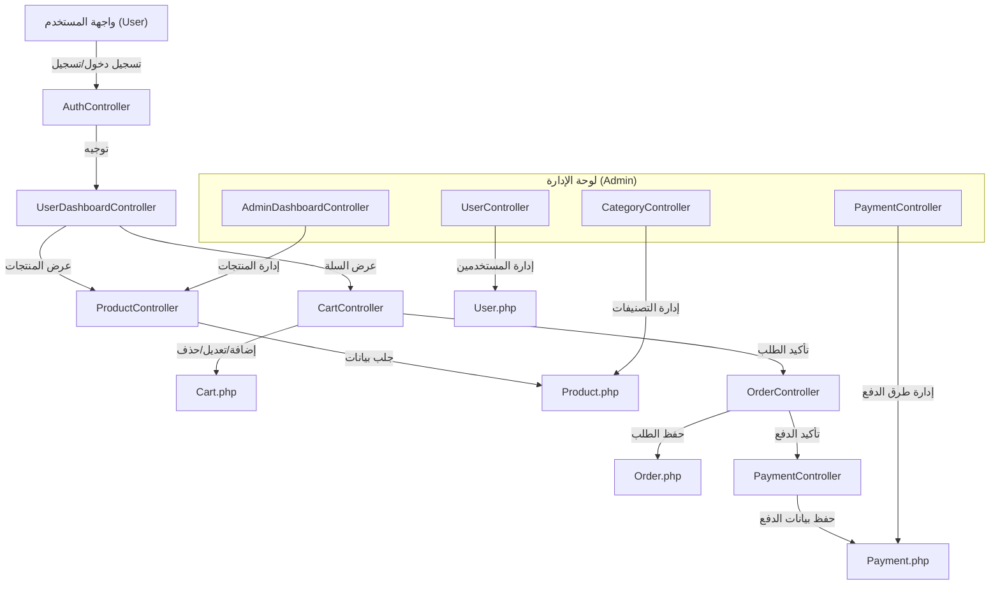

# 🚀 POS12 - نظام نقاط البيع الذكي (Laravel POS System)

<p align="center">
  
</p>

## 👋 مقدمة

نظام نقاط البيع POS12 هو تطبيق ويب متكامل لإدارة المتجر والمبيعات والمخزون، مبني على Laravel 11 مع واجهة مستخدم عصرية وسهلة الاستخدام. يدعم النظام اللغتين العربية والإنجليزية ويوفر تجربة سلسة لكل من المستخدم والإداري.

> "عايز تدير متجرك وتبيع منتجاتك بسهولة؟ جرب POS12!" 😎

---

## ✨ Features / المميزات
- إدارة المنتجات والتصنيفات
- سلة تسوق ديناميكية مع أزرار زيادة/نقص الكمية
- طرق دفع متعددة (فودافون كاش، إنستا باي، فيزا، باي بال ...)
- لوحة تحكم للإدارة (إضافة/تعديل/حذف)
- نظام صلاحيات (أدمين/مستخدم)
- تنبيهات SweetAlert تفاعلية تدعم اللغتين
- دعم كامل للغة العربية والإنجليزية
- تسجيل دخول عبر Google/GitHub
- تقارير ومراجعات وتعليقات

---

## 🖼️ لقطات من النظام

### صفحة الهوم:


### صفحة السلة:


---

## 🗂️ هيكل المشروع (Project Structure)

```text
app/
  ├── Http/
  │   ├── Controllers/ (User, Admin, Auth)
  │   ├── Middleware/
  │   └── Requests/
  ├── Models/ (Product, Cart, Order, Payment ...)
  ├── Services/ | Repositories/ | Interfaces/
  └── View/Components/
resources/
  ├── views/ (user, admin, components, ...)
  ├── lang/ (ar, en)
  └── js/, css/
routes/ (web.php, user.php, admin.php ...)
database/
  ├── migrations/ (جداول المستخدمين، المنتجات، الطلبات ...)
  └── seeders/, factories/
public/
  ├── productImages/, adminProfile/, customer/img/
  └── ...
```

---

## 🧩 مخطط معماري سريع



---

## ⚡️ كيف تبدأ؟ (Quick Start)

1. **انسخ المشروع:**
   ```bash
   git clone ...
   cd POS12
   composer install
   npm install && npm run dev
   cp .env.example .env
   php artisan key:generate
   ```
2. **جهز قاعدة البيانات:**
   - استورد ملف `database/mypos.sql` أو
   - شغل: `php artisan migrate --seed`
3. **شغل السيرفر:**
   ```bash
   php artisan serve
   ```
4. **بيانات دخول المشرف:**
   - الإيميل: `superadmin@gmail.com`
   - كلمة السر: `admin123`

---

## 💬 حوارات المستخدمين (User Stories)

- 🧑‍💼: "عايز أضيف منتج جديد بسرعة!"
- 👩‍💻: "ولا يهمك! من لوحة الإدارة دوس إضافة منتج واملأ البيانات."
- 🛒: "عايز أزود الكمية في السلة؟"
- 🤖: "اضغط + أو - والسعر بيتحدث تلقائي!"
- 💸: "إزاي أدفع بفودافون كاش أو باي بال؟"
- 👨‍💼: "اختار طريقة الدفع المناسبة وسيتم التحقق من رقمك تلقائي."

---

## 🛠️ أهم الحزم المستخدمة
- Laravel 11
- SweetAlert (realrashid/sweet-alert)
- Laravel Socialite (تسجيل دخول خارجي)
- TailwindCSS, Vite, Alpine.js, Axios

---

## 📜 رخصة الاستخدام

هذا المشروع مفتوح المصدر ومتاح للجميع مع حفظ الحقوق.

---

> "لو عندك أي سؤال أو اقتراح، ابعتلنا! 🤙"
